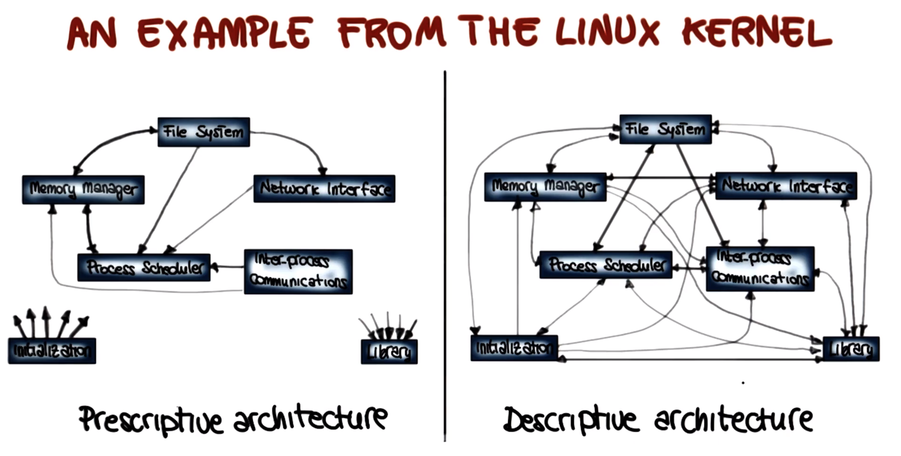

# Software Architecture(SWA)

## Interview of Nenad Medvidovic.
Software Architecture: Foundations, Theory, and Practice 2009. Wiley, ISBN 978-0-470-16774-8

## Software Erosion

## What's is software Architecture?

Perry and Wolf
SWA = {Elements(What), Form(How), Rationale(why)}

Shaw and Garland.
SWA is a level of design that involves
* Description of elements from which systems are built
* Interactions among those elements
* Patterns that guide their composition
* Constraints on these patterns

## A general definition of SWA
A Set of principal design decisions about the system.

## Prescriptive Architecture
It captures the design decisions prior to the system's construction.
As-Conceived SWA.

Prescriptive Arch should be modified first. However, this rarely happens.
* Developers' sloppiness
* Short deadlines
* Lack of documented prescriptive architecture.

## Descriptive Architecture
It describes how the system has actually been built.
As implemented SWA.

## Architectural Degradation

### Arch drift
Introduced orthogonal decisions to a system's prescriptive architecture.

### Arch erosion
Introduced decisions violated a system's prescriptive architecture.

## Arch. Elements

A software architecture typically is not a monolith.

### Components
* Processing elements: implement business logic and perform transformation on data.
* Date elements (information/state): 
  elements contained information that is used in processing elements.

#### Software Components
* Encapsulates a subset of the system's functionality and/or data.
* restrict access to that subset via an explicitly defined interface.

### Connectors
* Interaction elements: glue that holds different pieces together.
#### Software connector: architectural entity affecting and regulating interaction.

### Arch. configuration
Association between components and connectors of a software architecture.

## Architecture styles

* Pipe and filters: Unix commands,
* Event Driven: GUI
* Publish-subscribe: Twitter
* Client-Server : email
* Peer-to-peer
* REST
