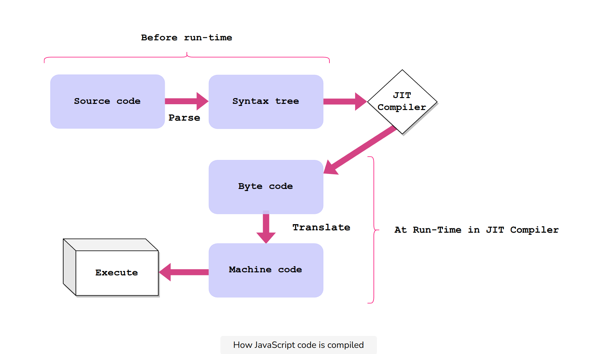

## How compilation work?

Interpretation.
JIT(Just In Time Compilation) - Chrome V8 Engine.


## Variables
```javascript
var var1 = 10; // local variable 
var2 = 10; //global var2
let var3 = 10; // block statements scope
const number=42; // block statements scope, can't be changed.
```


## Loops

```javascript
// for-each
var arr = [10, 25, 7, 100, 20]; // initialise arr
// iterate array from start to end
arr.forEach(x => console.log(x));
```

```javascript
// for-in
var obj = {'one': 1, 'two': 2, 'three': 3}; // initialise an object

for(var i in obj){
    console.log("key:",i, "value:",obj[i]); // print key and value
}
```

## Functions
```javascript
function sumFunc(a, b) {
    return a+b;
}

// anonymous function
var var1 = 5; // assign 5 to var1
var var2 = 6; // assign 6 to var2
var var3 = function (a , b){
    console.log('Taking sum in the function'); // print to see function execute
    var ans = a + b; // assign sum of a and b to ans
    return ans; // return ans as output
}
console.log(var3(var1, var2)); // print the value of var3


// Invoke functions at their declaration#
var var3 = function (a , b){
    console.log('Taking sum in the function'); // print to see function execute
    var ans = a + b; // assign sum of a and b to ans
    return ans; // return ans as output
}(var1, var2); // invoke the function

// arrow functions/fat arrow function / anonymous functions
var func = (a, b) => { // Create arrow function for taking sum of two numbers
    var sum = a + b; // take sum of a and b and assign to sum variable
    return sum; // return sum
}

// single-lined function
var func = (a, b) => a + b; // arrow function assigned to func to add a and b
console.log("Sum of 1 and 3:" , func(1,3)); // print func with arguments 1 and 3 

// single argument arrow function
var func = a  => a * 2; // func assigned to arrow function which doubles argument a

// arrow function without arguments.
var func =  () => console.log("Hello"); // arrow function that prints hello

// passing a function as an argument
function foo (func){ // Create function taking another function as argument
    console.log("in foo function");
    console.log("calling func");
    func(); // invoke the function passed as argument
    console.log("finished calling");
    console.log("returning");
}

foo(() => console.log("Hello")); // invoke foo and pass printHello as argument
```

### Array methods
```javascript
// forEach
var arr = [10, 20, 30, 40, 50]; // initialise an array and assign to arr
arr.forEach((val, ind, array) => { 
    // arrow function to print arguments (value, index, array)
    console.log("Value:", val, " Index:", ind, " arr:",array); // print values
    });
console.log(arr); // print array assigned to arr

// two arguments: (val, ind) =>
// one argument: (val) =>

// filter
var arr = [10, 20, 30, 40, 50]; // initialise an array and assign to arr
var arr1 = arr.filter(a => a > 30); // Filter elements greater than 30

// find
var arr = [10, 20, 30, 40, 50]; // initialise an array and assign to arr
var val = arr.find(a => a > 20); // find an element greater than 20
```

### Map and Reduce methods
```javascript
// map function to modify each elements
var arr = [10, 20, 30, 40, 50]; // initialise an array and assign to arr
var arr1 = arr.map(a => a * 2); // double the element in the array

// reduce function to reduces the array to a single value from left to right.
function callbackfn(prev: any, curr: any, index: number, array: number[])
// This callbackfn function takes from 2 to 4 arguments. 
var arr = [10, 20, 30, 40, 50]; // initialise an array and assign to arr
var val = arr.reduce((prev, curr) => prev + curr); // reduce element to sum

// Using the map and reduce methods to count elements
var arr = ['Hello', 1, true, NaN, 'Bye']; // initialise an array of elements
var countArr = arr.map(ele => typeof ele === 'string' ? 1 : 0); // map to 0 and 1
var sum = countArr.reduce((prev, curr)=> prev + curr); // reduce for sum
console.log("arr:",arr); // print original array
console.log("array from map:", countArr); // print array returned from map method
console.log("number of Strings:",sum); // print number of strings 

var sum = arr.map(ele => (typeof ele === 'string' ? 1 : 0) // map to 0 and 1
    ).reduce((prev, curr)=> prev + curr); // reduce to find sum
console.log("arr:",arr); // print original array
console.log("number of Strings:",sum); // print number of strings 

```

## Scope
Scopes restrict **access** and **visibility** of variables across a program.
* It limits the visibility and accessibility of a variable.
* It controls the life of the variable and the assigned resources.
* It helps secure resources and makes debugging easier.

### global scope

### local scope
* function scope
* block scope
  
### Lexical scope 

It is the ability for a function scope to access variables from the parent scope.
JavaScript uses a scope chain to find variables accessible in a certain scope. When a variable is referred to, JavaScript looks in the current scope and continues to parent scopes, until it reaches the global scope. This chain of traversed scopes is called the scope chain.

### Module scope

import/export module variables.

Modules use import/export usually in JavaScript Babel. In node.js, use require statements instead. This is mostly the same, except the require statement will import the entire module.