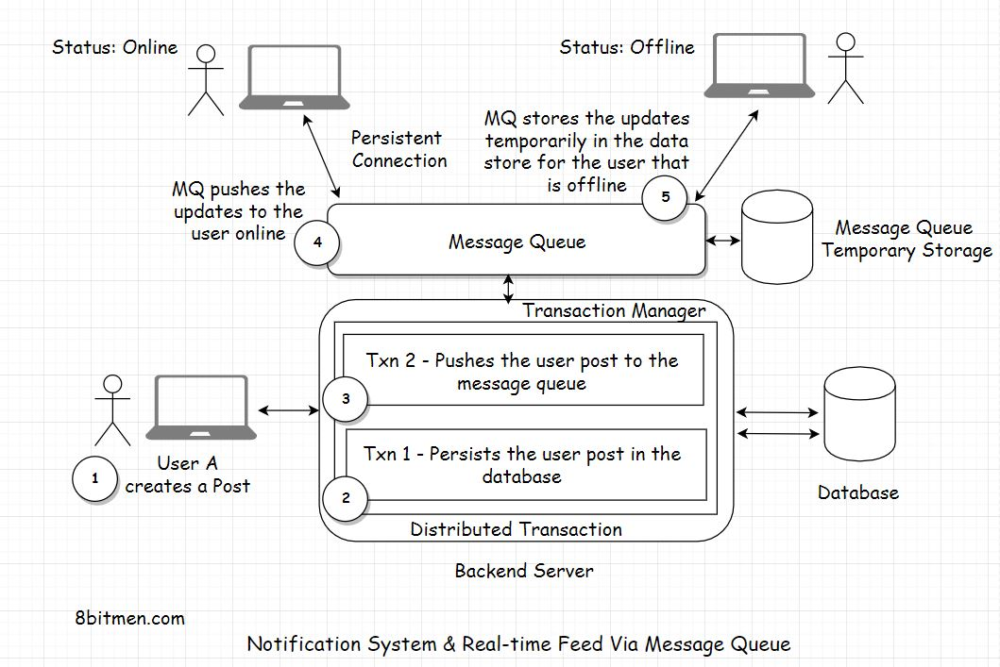

# Message Queues

*FIFO (First in First Out)*

A priority attached with them that makes the queue a *priority queue*

**From producer to consumer**

Message queues facilitate **asynchronous behaviour.**

Message queues are also used to implement notification systems just like Facebook notifications.

## Publish Subscribe Model

Multiple consuemer receive the same message sent from a single or multiple producers. newspaper service

Exchanges Types: ***direct*, *topic*, *headers*, *fanout***

[RabbitMQ](https://www.rabbitmq.com/tutorials/amqp-concepts.html)

The relationship between exchange and the queue is known as *Binding*.

## Point to Point Model

## Messaging protocols

[AMQP Advanced Message Queue Protocol](https://en.wikipedia.org/wiki/Advanced_Message_Queuing_Protocol) & [STOMP Simple or Streaming Text Oriented Message Protocol](https://en.wikipedia.org/wiki/Streaming_Text_Oriented_Messaging_Protocol).

## Technologies:

*RabbitMQ*, *ActiveMQ*, *Apache Kafka*, ZeroMQ

## Case study: notification systems&Real-time feeds

**How to implement this notifcation system?**

They involve machine learning, understanding the user behaviour, recommending new relevant information & integration of other modules with them

### Pull-based approach

Two major issues:

1. Polling DB too often

1. Updates not real-time

### Push-based approach

